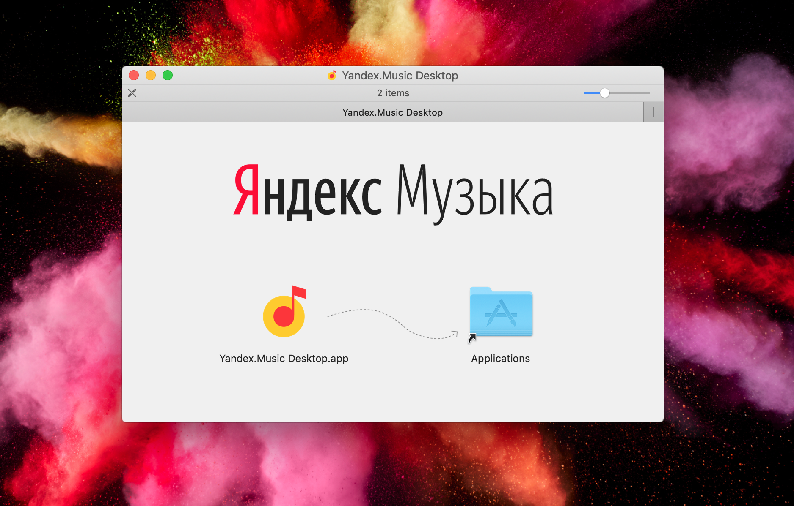

# Yandex.Music Desktop (un-official port of website)

**Please note:** this is _only_ desktop port of [Yandex.Music](https://music.yandex.ru) website.

_The author of this desktop port ([Vic Shóstak](https://github.com/koddr)) **is not** responsible for long support of this desktop application, because YANDEX LLC may changes the way it provides content and/or releases its own desktop application._

## The Why

I love listen music and always want to do it as easy as possible. Concept of Yandex.Music service (web for desktop clients and app for mobile) are great, but not so really.

## Terms of Use of Yandex.Music

All logos, images and Yandex.Music service website — belong to their respective owners, namely YANDEX LLC.

If you download, install and run _Yandex.Music Desktop_ application from current repository, you're already agree with official **Terms of Use of Yandex.Music**: [EN](https://yandex.ru/legal/music_termsofuse/?lang=en), [RU](https://yandex.ru/legal/music_termsofuse/?lang=en), [BY](https://yandex.ru/legal/music_termsofuse/?lang=en), [KZ](https://yandex.ru/legal/music_termsofuse/?lang=en).

## License

Yandex.Music Desktop (by [Vic Shóstak](https://github.com/koddr)) is an open source software under [MIT](LICENSE) license.
